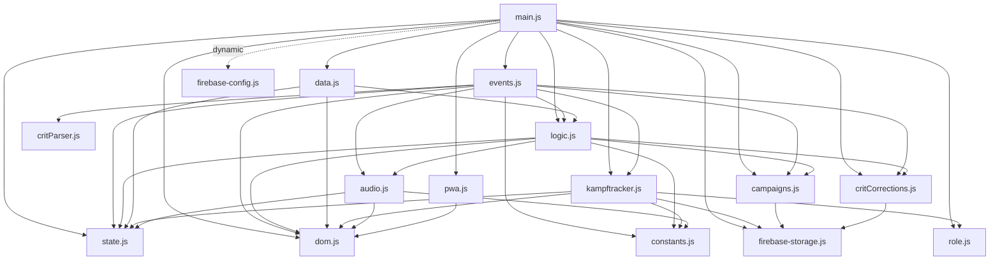
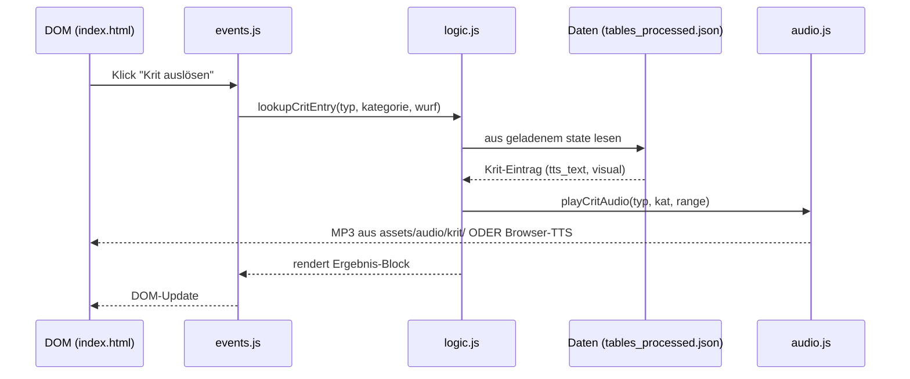

# Architektur der Runtime-App

Dieses Dokument beschreibt, wie die **Browser-App** aufgebaut ist – also was passiert, wenn jemand die PWA öffnet. Die Daten-Pipeline (Node-Skripte unter `tools/`) ist **kein** Teil der Runtime und in [DATA-PIPELINE.md](DATA-PIPELINE.md) beschrieben.

---

## Einstiegspunkte

- **`index.html`** – Lädt CSS aus `styles/`, das Intro-Video, alle Overlays und am Ende ein einziges Script-Tag:
  ```html
  <script type="module" src="scripts/main.js"></script>
  ```
- **`scripts/main.js`** – Bootstrap. Initialisiert (in dieser Reihenfolge): Firebase (optional, dynamisch importiert aus `private/firebase-config.js` mit Fallback auf `scripts/firebase-config.js`), Rollen-Auswahl, Tabs, Start-Screen, dann `initApp()` (lädt JSON-Daten, registriert Events, registriert Service Worker).
- **`sw.js`** – Service Worker. Precached die wichtigsten Runtime-Assets unter dem Cache-Namen `mers-vN`. Nach Änderungen an Runtime-Dateien Version hochzählen.

---

## Module unter `scripts/` (alphabetisch, mit Aufgabe)

| Datei | Aufgabe |
|---|---|
| `main.js` | Bootstrap, Tab-Switching, Rollen-/Charakterwahl, Firebase-Init |
| `data.js` | `fetch` der Runtime-JSON (siehe [DATA-FILES.md](DATA-FILES.md)), Aufbau Waffen-/Krit-Auswahl |
| `events.js` | Sämtliche DOM-Event-Listener: Angriff, Krit, Nebentreffer, Patzer, Schaden anwenden, Korrekturen |
| `logic.js` | Spielregeln: Angriffs-Berechnung, Krit-Lookup, TTS-Aufrufe, Ergebnis-Rendering |
| `kampftracker.js` | Initiative, Gegner-/Spieler-/NPC-Listen, Charakterwahl-Overlay, Firebase-Hooks |
| `campaigns.js` | Kampagnen, Charaktere, Gegner, Runden-Logik (Schaden, Status, Heilung) |
| `firebase-storage.js` | Firebase Realtime Database (oder Fallback auf localStorage), Sync, Krit-Korrekturen |
| `critCorrections.js` | Krit-Text-Korrekturen (lokal + Firebase) |
| `critParser.js` | Parsen freier Krit-Texte für „Schaden anwenden" |
| `audio.js` | Krit-MP3-Wiedergabe + Hintergrundmusik |
| `state.js` | Geteilter, mutabler App-State (Singleton) |
| `dom.js` | `$`, `$$`, `chip`, `pill` – DOM-Hilfen |
| `constants.js` | Asset-URLs (`URLS.*`), Waffen-Gruppen, Patzer-Modifikatoren, Charakter-Icons |
| `role.js` | Rolle (Spielleiter / Spieler) und ausgewählter Charakter |
| `pwa.js` | PWA-Install-Prompt, Service-Worker-Registrierung |
| `firebase-config.js` | **Deployment-Config** (für GitHub Pages eingecheckt). Lokal überschrieben durch `private/firebase-config.js`. |
| `firebase-config.example.js` | Vorlage zum Kopieren nach `private/firebase-config.js` |

---

## Abhängigkeitsgraph

Die Pfeile zeigen `import`-Beziehungen (statisch).



Beobachtungen:
- **`state.js` und `dom.js` sind Blätter** – sie haben keine eigenen Imports und werden von praktisch allen Modulen genutzt.
- **`firebase-storage.js` ist der einzige Berührungspunkt mit Firebase.** Wenn keine `firebase-config.js` da ist oder die Init scheitert, fallen `campaigns`, `kampftracker` und `critCorrections` automatisch auf localStorage zurück.
- **Audio liegt zweistufig vor:** `audio.js` (Wiedergabe) und `logic.js` / `events.js` (Auslöser). Audio-Dateien folgen dem kanonischen Layout `assets/audio/krit/<tableSlug>/<KAT>_<RANGE>.mp3` (Builder in `scripts/audioNaming.mjs`).

---

## Datenfluss eines Krit-Treffers (Beispiel)



---

## Was die App **NICHT** zur Laufzeit kennt

- Die Daten-Pipeline (`tools/`) ist nur Build-Zeit-Tooling. Die fertigen JSON-Dateien werden eingecheckt und vom Browser direkt geladen.
- PDFs in `assets/source/` sind **Quellmaterial**, nicht Runtime.
- Inhalte in `assets/data/_pipeline/` sind **Zwischenergebnisse** der Pipeline und werden vom Browser nicht geladen.
- Alles unter `tools/_archive/` und `_archive_obsolete/` ist veraltet und ohne Funktion.

---

## Wann muss `sw.js` aktualisiert werden?

Wenn sich eine der folgenden Dateien ändert, **`CACHE_NAME` in `sw.js` hochzählen** (z.B. `mers-v6` → `mers-v7`), damit Clients die neue Version sicher laden:

- Eine der Dateien in der `ASSETS`-Liste in `sw.js`
- Eine der Runtime-JSON-Dateien (`assets/data/treffer_tabellen_strukturiert.json`, `tables_processed.json`)

Ein neues Krit-MP3 muss **nicht** zwingend zu einem Bump führen – die fetch-Strategie ist „network first" mit Cache-Fallback, neue Audio-Dateien werden also normalerweise auf Anhieb geladen.
