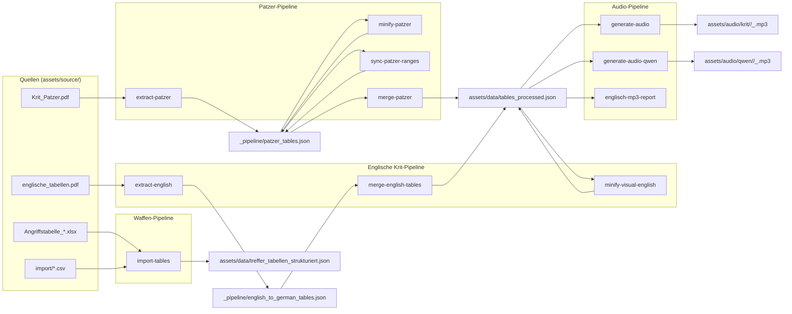

# Daten-Pipeline (Node-Skripte unter `tools/`)

Die Pipeline ist ein loser Strauss von Node-Skripten, der **einmalig** läuft, wenn neue Tabellen, Patzer oder Audio-Dateien digitalisiert werden. Sie hat **nichts mit der Browser-App** zu tun – die App liest nur die fertigen Runtime-JSON-Dateien (siehe [DATA-FILES.md](DATA-FILES.md)).

> **Gerade neue Tabelle digitalisieren?** Lies zuerst [HOWTO-NEW-TABLE.md](HOWTO-NEW-TABLE.md). Dieses Dokument hier ist die Referenz für „welcher Schritt produziert welche Datei".

---

## Übersicht

Legende:
- Grün/oben: **Quellen** (PDFs, Excel, CSV) liegen in `assets/source/` bzw. `import/`.
- Grau: **Pipeline-Schritte** entsprechen je einem `npm run …`.
- Blau: **Zwischenergebnisse** unter `assets/data/_pipeline/`.
- Rot: **Runtime-Outputs** (`assets/data/*.json`, `assets/audio/krit/<tableSlug>/<KAT>_<RANGE>.mp3`) – das, was die App lädt.

---

## Voraussetzungen

1. `node_modules/` installiert: `npm install`
2. `private/.env` mit den nötigen API-Keys, siehe [`private/README.md`](../private/README.md):
   - `GEMINI_API_KEY` für PDF-Extraktion und Visual-Minify
   - `ELEVENLABS_API_KEY` und `ELEVENLABS_VOICE_ID` für Cloud-Audio (`generate-audio`)
   - Qwen lokal (`generate-audio-qwen`) braucht keinen API-Key, sondern `~/local-tts`

---

## Skripte im Detail

### Patzer

| npm-Skript | Datei | Input | Output |
|---|---|---|---|
| `extract-patzer` | `tools/pdf-extract/extract_patzer_pdf.js` | `assets/source/Krit_Patzer.pdf` | `assets/data/_pipeline/patzer_tables.json` |
| `minify-patzer` | `tools/tables/minify_patzer_visual.js` | `_pipeline/patzer_tables.json` | (in-place, ergänzt `visual` pro Eintrag) |
| `sync-patzer-ranges` | `tools/tables/apply_patzer_range_labels.js` | `_pipeline/patzer_tables.json` + `tables_processed.json` | beide aktualisiert (nur Würfelbereich-Labels) |
| `merge-patzer` | `tools/tables/merge_patzer_into_tables_processed.js` | `_pipeline/patzer_tables.json` | `assets/data/tables_processed.json`, `_pipeline/patzer_modifiers.json` |

Reihenfolge: `extract-patzer` → `minify-patzer` → ggf. `sync-patzer-ranges` → `merge-patzer`.

### Englische (übersetzte) Krit-Tabellen

| npm-Skript | Datei | Input | Output |
|---|---|---|---|
| `extract-english` | `tools/pdf-extract/extract_english_pdf.js` | `assets/source/englische_tabellen.pdf` | `_pipeline/english_to_german_tables.json` |
| `merge-english-tables` | `tools/tables/merge_english_german_into_tables.js` | `_pipeline/english_to_german_tables.json` | `assets/data/tables_processed.json` (+ `tools/tables/.english_zusatz_table_keys.json`) |
| `minify-visual-english` | `tools/tables/minify_visual_text.js` (mit `MINIFY_ENGLISH_ZUSATZ_ONLY=1`) | `tables_processed.json` (gefiltert über die Keys-Liste) | dieselbe Datei (in-place) |

Reihenfolge: `extract-english` → `merge-english-tables` → `minify-visual-english`.

### Allgemeines Visual-Minify

| npm-Skript | Datei | Input | Output |
|---|---|---|---|
| `minify-visual` | `tools/tables/minify_visual_text.js` | `tables_processed.json` | `_pipeline/tables_final.json` |

> Verwendet denselben System-Prompt wie `minify-patzer`. Bei Anpassungen am Prompt bewusst beide synchron halten (Kommentar-Header in beiden Dateien).

### Tabellen-Cleanup (selten)

| npm-Skript | Datei | Input | Output |
|---|---|---|---|
| `clean-tables` | `tools/tables/clean_tables_with_gemini.js` | `tables_processed.json` | `_pipeline/tables_clean.json` |
| `clean-tables-all` | dasselbe mit `--all` | s.o. | s.o. |

### Waffen-Tabellen / CSV-Import

| npm-Skript | Datei | Input | Output |
|---|---|---|---|
| `import-tables` | `tools/tables/import_and_fix_tables.js` | `import/*.csv` (priorisiert) und `assets/templates/*.csv` (Fallback) | `assets/data/treffer_tabellen_strukturiert.json` (gemerged, behält andere Keys) |
| `import-gegner-tables` | `tools/tables/import_gegner_tables.js` | `assets/templates/ANGRIFFSTABELLEN_GEGNER.xlsx` | `treffer_tabellen_strukturiert.json` → `GegnerAngriffstabellen` |

CSV-Dateinamen (z.B. `beissen.csv`, `pieksen.csv`) werden auf Waffen-Keys gemappt – siehe `TABLE_CONFIG` im Skript.

### Audio

| npm-Skript | Datei | Input | Output |
|---|---|---|---|
| `generate-audio-qwen` | `tools/audio/generate_audio_qwen.js` + `qwen_tts_worker.py` | `tables_processed.json` | `assets/audio/qwen/<tableSlug>/<KAT>_<RANGE>.mp3` (Bud2, Setting in `qwen_tts_settings.json`) |
| `generate-audio` | `tools/audio/generate_audio_elevenlabs.js` | `tables_processed.json` | `assets/audio/krit/…` (ElevenLabs) |
| `migrate-audio-layout-dry` / `migrate-audio-layout` | `tools/audio/migrate_audio_layout.js` | bestehende `assets/audio/krit/*.mp3` (legacy flat) | kanonisches Subfolder-Layout |
| `validate-audio-index` | `tools/audio/validate_audio_index.js` | `tables_processed.json` + `assets/audio/krit/` | Fehlermeldung bei fehlenden MP3s |
| `englisch-mp3-archive` | `tools/audio/englisch_krit_audio_tool.js archive` | `assets/audio/krit/` (Englisch-Reste) | verschiebt non-canonical MP3s in `_archive_englisch_non_canonical/<Datum>/` |
| `englisch-mp3-report` | dasselbe Tool, Modus `report` | `tables_processed.json` + `assets/audio/krit/` | Report über fehlende/überflüssige MP3s |

> **Qwen:** schreibt nach `assets/audio/qwen/`, überschreibt ElevenLabs nicht. Studio nicht nötig. Ctrl+C ist sicher. Details: [HOWTO-NEW-AUDIO.md](HOWTO-NEW-AUDIO.md).
>
> **ElevenLabs** ist **kostenpflichtig**. Skript generiert nur Fehlendes.

---

## Welche Zwischenstände dürfen archiviert werden?

Safe-only (ohne Runtime-Risiko):
- `_archive_obsolete/pipeline_optional/tables_clean.json` (nur Cleanup-Inspektion)
- `_archive_obsolete/pipeline_optional/patzer_modifiers.json` (nur Referenz-Ausgabe)

Behalten (aktive Pipeline-Inputs/-Zwischenstände):
- `assets/data/_pipeline/patzer_tables.json`
- `assets/data/_pipeline/english_to_german_tables.json`

Nicht archivieren (Runtime-kritisch):
- `assets/data/treffer_tabellen_strukturiert.json`
- `assets/data/tables_processed.json`
- `assets/data/patzer_default.json`

---

## Archivierte / nicht mehr verdrahtete Skripte

Unter `tools/_archive/` liegen Skripte, die **nicht in `package.json`** verlinkt sind und nur noch zur Referenz da sind:

- `app.js` – legacy single-file Browser-App, wurde durch `scripts/main.js` + Module ersetzt.
- `fix_weapons_data.js` – Einmal-Fix für `treffer_tabellen_strukturiert.json`.
- `classify_crit_severity_with_gemini.js` – Experiment, Schweregrad pro Krit klassifizieren.
- `import_weapons.py` – Python-Excel-Import (vorher von `import_and_fix_tables.js` abgelöst).

**Nicht löschen** – als Vorlage nützlich, falls man Ähnliches wieder machen möchte.

---

## Häufige Fragen

**Q: Ich habe einen kleinen Fehler in einem Krit-Text gefunden. Wo ändern?**
A: Direkt in `assets/data/tables_processed.json` (Hand-Edit ist OK). Pipeline neu laufen lassen ist nur nötig, wenn die Quelle (PDF) geändert wurde.

**Q: Reihenfolge der Pipeline-Schritte vergessen?**
A: Siehe Mermaid-Diagramm oben oder [HOWTO-NEW-TABLE.md](HOWTO-NEW-TABLE.md).

**Q: Ich habe ein neues MP3 generiert, sehe es aber nicht in der App.**
A: Service-Worker-Cache. `CACHE_NAME` in `sw.js` hochzählen, oder Hard-Reload. Siehe [ARCHITECTURE.md](ARCHITECTURE.md).
