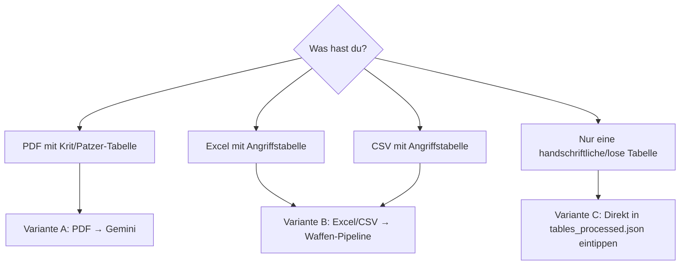

# HOWTO: Neue Tabelle digitalisieren

Du willst eine **neue Krit-, Patzer- oder Angriffstabelle** in die App bringen? Dieses Dokument zeigt, welcher Pfad der richtige ist – ohne dass du neuen Code schreiben musst, der schon existiert.

> **Faustregel:** Bevor du ein neues Skript anlegst, schau immer zuerst in [DATA-PIPELINE.md](DATA-PIPELINE.md) und [DATA-FILES.md](DATA-FILES.md) ob es nicht schon eine Vorlage gibt.

---

## Was hast du an Quelle?



---

## Variante A — PDF → Gemini-Extraktion (Krit-/Patzer-Tabellen)

Vorlagen: [`tools/pdf-extract/extract_patzer_pdf.js`](../tools/pdf-extract/extract_patzer_pdf.js) und [`tools/pdf-extract/extract_english_pdf.js`](../tools/pdf-extract/extract_english_pdf.js).

### Schritte

1. **PDF ablegen** in `assets/source/<dein_name>.pdf`.
2. **Extraktions-Skript schreiben** – kopiere die strukturell näher passende Vorlage (`extract_patzer_pdf.js` für eine kompakte Tabelle, `extract_english_pdf.js` für eine Tabelle pro Spalte/Severity-Stufe) nach z.B. `tools/pdf-extract/extract_<dein_name>_pdf.js`. Anpassen:
   - `PDF_PATH` auf deine neue Quelle.
   - `OUTPUT_PATH` nach `assets/data/_pipeline/<dein_name>.json`.
   - System-Prompt / Schema an die Tabellenstruktur anpassen.
3. **In `package.json` verdrahten:**
   ```json
   "extract-<dein_name>": "node tools/pdf-extract/extract_<dein_name>_pdf.js"
   ```
4. **Trockenlauf:** `npm run extract-<dein_name>` und Resultat in `_pipeline/<dein_name>.json` prüfen.
5. **Visual-Minify** falls die Tabelle ein `tts_text`/`visual`-Feld hat:
   - Bestehendes Skript wiederverwenden: `tools/tables/minify_visual_text.js` arbeitet auf `tables_processed.json`. Wenn deine Tabelle dort liegt, einfach `npm run minify-visual` für eine bestimmte Teilmenge.
   - Sonst: kleine Anpassung in `minify_visual_text.js` (Filterung) statt neuem Skript.
6. **Merge ins Runtime-JSON** – Vorlage: [`tools/tables/merge_english_german_into_tables.js`](../tools/tables/merge_english_german_into_tables.js) oder [`tools/tables/merge_patzer_into_tables_processed.js`](../tools/tables/merge_patzer_into_tables_processed.js).
   - Kopiere und passe an, sodass die neue Tabelle in `assets/data/tables_processed.json` unter dem richtigen Schlüssel landet.
   - In `package.json` verdrahten als `"merge-<dein_name>": "..."`.
7. **App ausprobieren** (siehe Abschnitt „Smoke-Test" unten).

### Häufiger Fehler

- **`OUTPUT_PATH` fehlt im Verzeichnis.** Stelle sicher, dass `assets/data/_pipeline/` existiert (sollte schon, sonst `mkdir`).
- **Gemini schneidet Antworten ab.** `extract_english_pdf.js` zeigt eine Lösung: pro Tabelle/Spalte einzelner Request statt ein grosser.

---

## Variante B — Angriffstabelle (Excel/CSV → Waffen-Pipeline)

Vorlage: [`tools/tables/import_and_fix_tables.js`](../tools/tables/import_and_fix_tables.js).

### Schritte

1. **CSV erzeugen** (z.B. aus Excel) und in `import/<waffe>.csv` ablegen.
   Format: Semikolon-getrennt, eine Spalte pro RK-Klasse, eine Zeile pro Angriffswurf.
2. **Mapping ergänzen** – im Skript [`tools/tables/import_and_fix_tables.js`](../tools/tables/import_and_fix_tables.js) gibt es ein `TABLE_CONFIG` (Dateiname → JSON-Key). Neuen Eintrag dort hinzufügen.
3. **Ausführen:** `npm run import-tables`.
4. **Prüfen:** `assets/data/treffer_tabellen_strukturiert.json` enthält die neue Waffe als zusätzlichen Top-Level-Key (alte Keys bleiben erhalten – das Skript merged, überschreibt nicht).
5. **In der App** sollte die neue Waffe nun in den Auswahl-Buttons erscheinen, sofern sie in [`scripts/constants.js`](../scripts/constants.js) (`WEAPON_LABELS`, `WEAPON_SIZE_VARIANTS`) registriert ist. Falls nicht: dort ergänzen.

> Achtung: das Excel-Skript `tools/_archive/import_weapons.py` ist abgelöst. Nicht mehr verwenden.

---

## Variante B2 — Gegner-Angriffstabellen (Excel)

Quelle: [`assets/templates/ANGRIFFSTABELLEN_GEGNER.xlsx`](../assets/templates/ANGRIFFSTABELLEN_GEGNER.xlsx) (6 Sheets: 1HKW, 1HSW, 2HW, FKW, ZuK, RuS).

Vorlage: [`tools/tables/import_gegner_tables.js`](../tools/tables/import_gegner_tables.js).

### Schritte

1. Excel pflegen (Spalten PL/KE/VL/LE/OR, Zeilen Angriffswurf-Bereiche).
2. **Ausführen:** `npm run import-gegner-tables` (optional `--dry-run`).
3. **Prüfen:** `assets/data/treffer_tabellen_strukturiert.json` → Block `GegnerAngriffstabellen`.
4. **Runtime:** Schatten-Modus im Simulator; Ziel-Charaktere brauchen `ruestungTyp` (PL|KE|VL|LE|OR) im Bearbeiten-Dialog.
5. `CACHE_NAME` in `sw.js` erhöhen.

ZuK/RuS haben Grössen-Blöcke (klein/mittel/gross) – in der App über **Schatten-Musik-Kategorie** (Angreifer-Grösse) gesteuert.

---

## Variante C — Manuelle Hand-Edits in `tables_processed.json`

Wenn es nur ein paar wenige Einträge sind: **direkt** in `assets/data/tables_processed.json` editieren ist legitim. Format:

```json
{
  "<Krit-Typ>": {
    "<Kategorie>": {
      "<Würfelbereich>": {
        "tts_text": "Voller Vorlesetext mit Fluff …",
        "visual": "Compact Crunch +6T 1 Rd ben"
      }
    }
  }
}
```

Wenn der `visual`-Text fehlt oder leer ist, kannst du anschliessend einmal `npm run minify-visual` laufen lassen – es ergänzt nur fehlende Felder (`FORCE_MINIFY_ALL=1` würde alles neu machen).

---

## Audio nicht vergessen

Sobald deine Krit-Tabelle in `tables_processed.json` ist, generiere die Sprach-MP3s, sonst nutzt die App nur Browser-TTS:

```bash
npm run generate-audio
```

Details und API-Key-Setup siehe [HOWTO-NEW-AUDIO.md](HOWTO-NEW-AUDIO.md).

---

## Smoke-Test (immer am Ende)

1. **Service-Worker Cache bumpen:** in [`sw.js`](../sw.js) `CACHE_NAME` um eins erhöhen, z.B. `mers-v6` → `mers-v7`.
2. **App lokal starten:** `npm run serve` (oder `python3 -m http.server 8765`).
3. Browser öffnen, Hard-Reload (Cmd+Shift+R) – Service-Worker holt frische Dateien.
4. Im Simulator deine neue Tabelle testen: passender Krit-Wurf, Audio, Visual.
5. Falls Firebase aktiv: in einer zweiten Session prüfen, dass nichts in der Sync-Logik kaputt ist.

---

## Wann lohnt es sich, **doch** ein neues Skript zu schreiben?

- Eine völlig neue Datenquelle (z.B. ein Webservice statt PDF).
- Ein Output-Format, das es noch nicht gibt (z.B. Audio mit anderer Engine).

Sonst: **Vorlage kopieren, anpassen, in `package.json` verdrahten.** Niemals ein bestehendes Pipeline-Skript ohne Not duplizieren – sie sind in `tools/<unterordner>/` thematisch sortiert.
